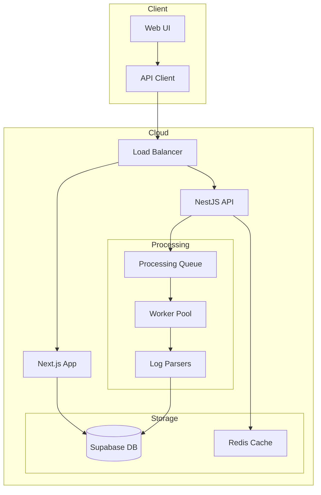
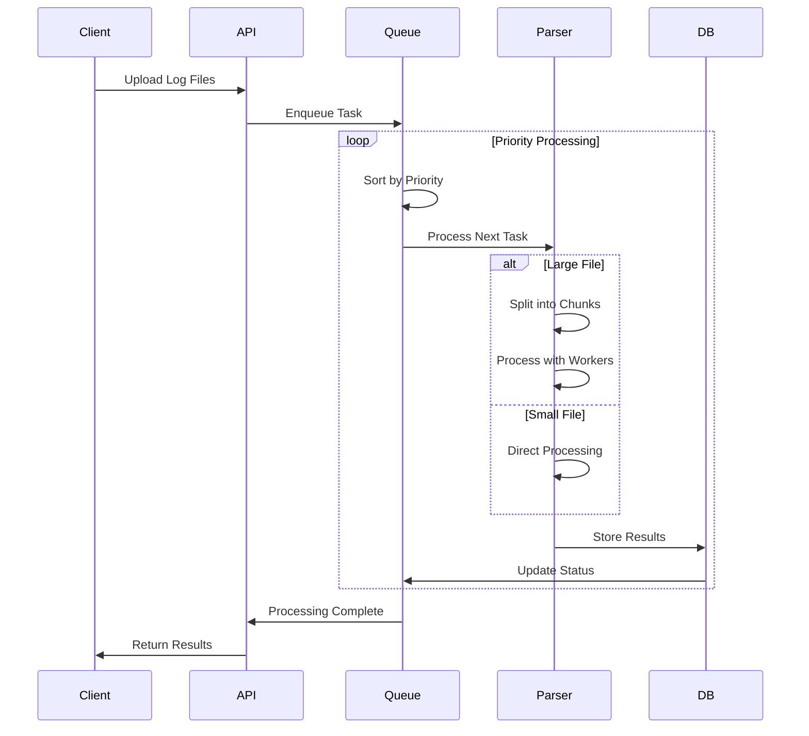
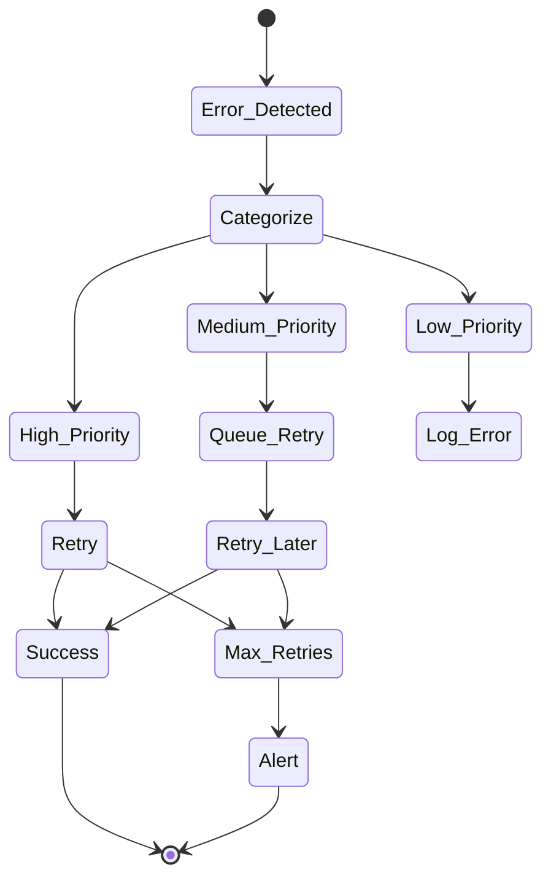
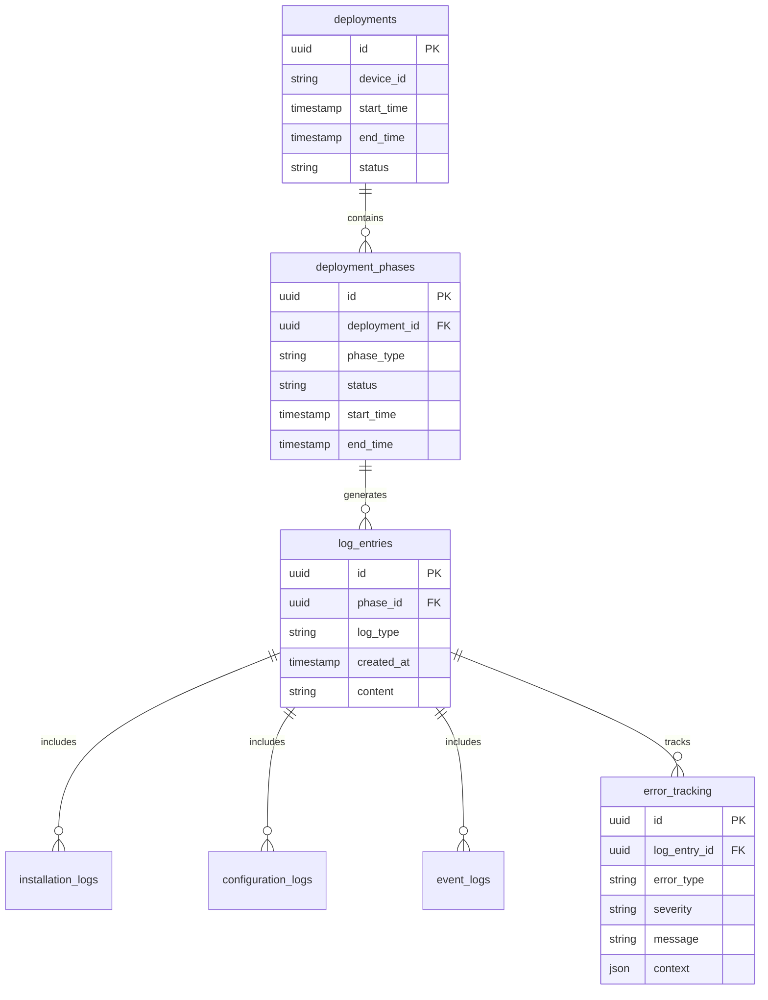
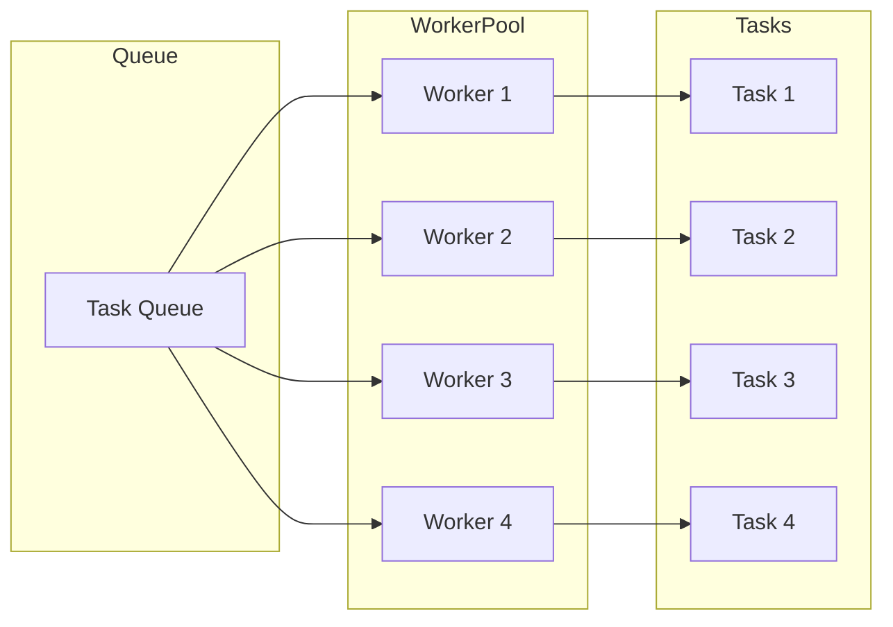
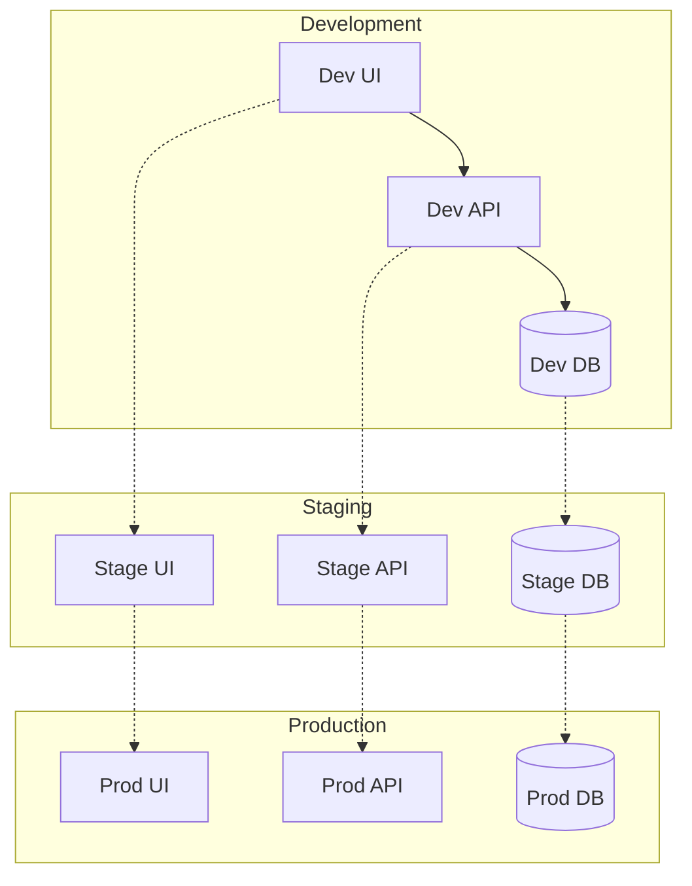

# Architecture Diagrams

## System Overview

```mermaid
graph TB
    subgraph Client
        UI[Web UI]
        API[API Client]
    end

    subgraph Cloud
        LB[Load Balancer]
        APP[Next.js App]
        NestAPI[NestJS API]
        
        subgraph Processing
            Queue[Processing Queue]
            Workers[Worker Pool]
            Parsers[Log Parsers]
        end
        
        subgraph Storage
            Supabase[(Supabase DB)]
            Cache[Redis Cache]
        end
    end

    UI --> API
    API --> LB
    LB --> APP
    LB --> NestAPI
    NestAPI --> Queue
    Queue --> Workers
    Workers --> Parsers
    Parsers --> Supabase
    NestAPI --> Cache
    APP --> Supabase
```

## Log Processing Pipeline

```mermaid
sequenceDiagram
    participant Client
    participant API
    participant Queue
    participant Parser
    participant DB

    Client->>API: Upload Log Files
    API->>Queue: Enqueue Task
    
    loop Priority Processing
        Queue->>Queue: Sort by Priority
        Queue->>Parser: Process Next Task
        
        alt Large File
            Parser->>Parser: Split into Chunks
            Parser->>Parser: Process with Workers
        else Small File
            Parser->>Parser: Direct Processing
        end
        
        Parser->>DB: Store Results
        DB->>Queue: Update Status
    end
    
    Queue->>API: Processing Complete
    API->>Client: Return Results
```

## Error Handling Flow

```mermaid
stateDiagram-v2
    [*] --> Error_Detected
    
    Error_Detected --> Categorize
    Categorize --> High_Priority
    Categorize --> Medium_Priority
    Categorize --> Low_Priority
    
    High_Priority --> Retry
    Medium_Priority --> Queue_Retry
    Low_Priority --> Log_Error
    
    Retry --> Success
    Retry --> Max_Retries
    
    Queue_Retry --> Retry_Later
    Retry_Later --> Success
    Retry_Later --> Max_Retries
    
    Max_Retries --> Alert
    Success --> [*]
    Alert --> [*]
```

## Database Schema

```mermaid
erDiagram
    deployments ||--o{ deployment_phases : contains
    deployment_phases ||--o{ log_entries : generates
    log_entries ||--o{ installation_logs : includes
    log_entries ||--o{ configuration_logs : includes
    log_entries ||--o{ event_logs : includes
    log_entries ||--o{ error_tracking : tracks

    deployments {
        uuid id PK
        string device_id
        timestamp start_time
        timestamp end_time
        string status
    }

    deployment_phases {
        uuid id PK
        uuid deployment_id FK
        string phase_type
        string status
        timestamp start_time
        timestamp end_time
    }

    log_entries {
        uuid id PK
        uuid phase_id FK
        string log_type
        timestamp created_at
        string content
    }

    error_tracking {
        uuid id PK
        uuid log_entry_id FK
        string error_type
        string severity
        string message
        json context
    }
```

## Worker Thread Pool

```mermaid
graph LR
    subgraph Queue
        TQ[Task Queue]
    end

    subgraph WorkerPool
        W1[Worker 1]
        W2[Worker 2]
        W3[Worker 3]
        W4[Worker 4]
    end

    subgraph Tasks
        T1[Task 1]
        T2[Task 2]
        T3[Task 3]
        T4[Task 4]
    end

    TQ --> W1
    TQ --> W2
    TQ --> W3
    TQ --> W4

    W1 --> T1
    W2 --> T2
    W3 --> T3
    W4 --> T4
```

## Deployment Architecture

```mermaid
graph TB
    subgraph Development
        Dev_UI[Dev UI]
        Dev_API[Dev API]
        Dev_DB[(Dev DB)]
    end

    subgraph Staging
        Stage_UI[Stage UI]
        Stage_API[Stage API]
        Stage_DB[(Stage DB)]
    end

    subgraph Production
        Prod_UI[Prod UI]
        Prod_API[Prod API]
        Prod_DB[(Prod DB)]
    end

    Dev_UI --> Dev_API
    Dev_API --> Dev_DB
    
    Dev_UI -.-> Stage_UI
    Dev_API -.-> Stage_API
    Dev_DB -.-> Stage_DB
    
    Stage_UI -.-> Prod_UI
    Stage_API -.-> Prod_API
    Stage_DB -.-> Prod_DB
```
